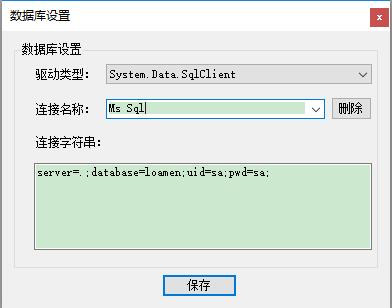
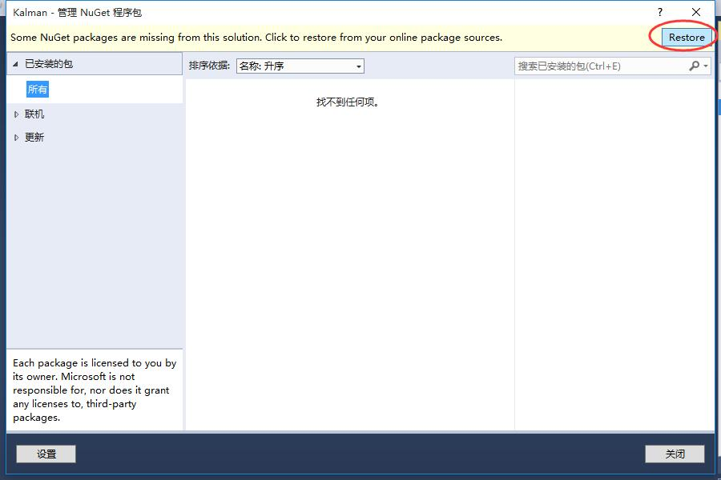

# Kalman.Studio
开发辅助工具，内置基于T4的代码生成器。

作者博客：http://www.cnblogs.com/lingyun_k
QQ群：122161138

 

 
 

## 软件主要功能如下：

	1、基于T4的代码生成工具，根据数据库元数据信息生成代码，支持多数据库，支持批量代码生成；
	2、支持根据PowerDesigner物理模型文件来生成代码；
	3、内置了一个简单的文本编辑器，支持代码高亮显示；
	4、数据库元数据信息浏览工具；
	5、数据库文档生成工具，支持输出word及pdf文件格式；
	6、IIS日志解析器，小网站可以用用；
	7、其他工具，字符串相关操作等。

## 一、软件界面

## 二、更新日志

2018-07-25

	* 修正MySql无法连接的问题；
	* 修正MySql、Sqlite、Access无法查询数据的问题；
	+ 添加数据库连接配置；
	* 调整一些界面细节；

2017-09-15

	* 升级.Net Framework到4.6；
	* 升级某些依赖项；
	* 修正生成代码报错的问题；
	* 调整一些界面细节；
